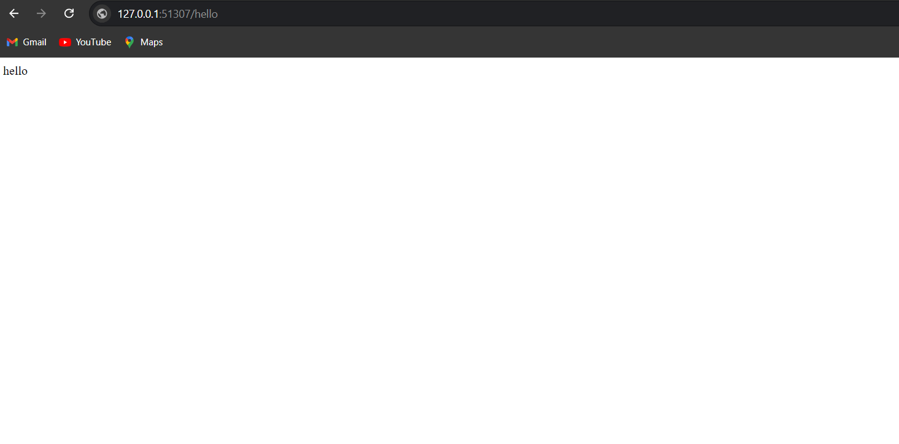

<h1>Hello World Microservices Application</h1>

This project demonstrates a microservices architecture with three services:

<ul>
    <li><strong>hello-service</strong>: Returns the message "hello".</li>
    <li><strong>world-service</strong>: Returns the message "world".</li>
    <li><strong>integration-service</strong>: Calls both Hello and World services and returns "hello world".</li>
</ul>

<h2>Table of Contents</h2>
<ol>
    <li><a href="#setup-and-running-locally">Setup and Running Locally</a></li>
    <li><a href="#dockerization">Dockerization</a></li>
    <li><a href="#kubernetes-deployment">Kubernetes Deployment</a></li>
</ol>

<h2 id="setup-and-running-locally">1. Setup and Running Locally</h2>

<h3>1.1 Clone the Repository</h3>
<pre><code>git clone https://github.com/Kruti0910/Hello-World-Microservices-Application.git</code></pre>

<h3>1.2 Install Dependencies</h3>

Navigate to each service directory (<code>hello-service</code>, <code>world-service</code>, and <code>integration-service</code>) and run:

<pre><code>npm install</code></pre>

<h3>1.3 Test Services Locally</h3>

Run each service using:

<pre><code>node index.js</code></pre>

Access the services via the following URLs:

<table>
    <thead>
        <tr>
            <th>Service</th>
            <th>Port</th>
            <th>URL</th>
        </tr>
    </thead>
    <tbody>
        <tr>
            <td>hello-service</td>
            <td>8990</td>
            <td><a href="http://localhost:8990/hello">http://localhost:8990/hello</a></td>
        </tr>
        <tr>
            <td>world-service</td>
            <td>8991</td>
            <td><a href="http://localhost:8991/world">http://localhost:8991/world</a></td>
        </tr>
        <tr>
            <td>integration-service</td>
            <td>8992</td>
            <td><a href="http://localhost:8992/">http://localhost:8992/</a></td>
        </tr>
    </tbody>
</table>

<h3>Screenshots:</h3>

<ul>
    <li><strong>Hello Service:</strong></li>
    
    <li><strong>World Service:</strong></li>
    
    <li><strong>Integration Service:</strong></li>
    
</ul>

<h2 id="dockerization">2. Dockerization</h2>

<h3>2.1 Dockerfiles</h3>

Dockerfiles are provided for each service in their respective directories.

<h3>2.2 Build Docker Images</h3>

Build Docker images for each service:

<pre><code>docker build -t hello-service ./hello-service
docker build -t world-service ./world-service
docker build -t integration-service ./integration-service</code></pre>

<h3>2.3 Run the Containers</h3>

Verify that the services work independently before deploying them to Kubernetes:

<pre><code>docker run -p 8990:8990 hello-service
docker run -p 8991:8991 world-service
docker run -p 8992:8992 integration-service</code></pre>

<h2 id="kubernetes-deployment">3. Kubernetes Deployment</h2>

<h3>3.1 Deploy to Kubernetes</h3>

Apply the Kubernetes manifests:

<pre><code>kubectl apply -f hello-service.yaml
kubectl apply -f world-service.yaml
kubectl apply -f integration-service.yaml</code></pre>

<h3>3.2 Expose Services</h3>

Use <code>kubectl port-forward</code> to access the services from your local machine:

<pre><code>kubectl port-forward service/integration-service 8080:80</code></pre>

<h3>3.3 Test the Integration</h3>

Access the combined "Hello World" output at:

<a>http://localhost:<your_deployed_port_num></a>

